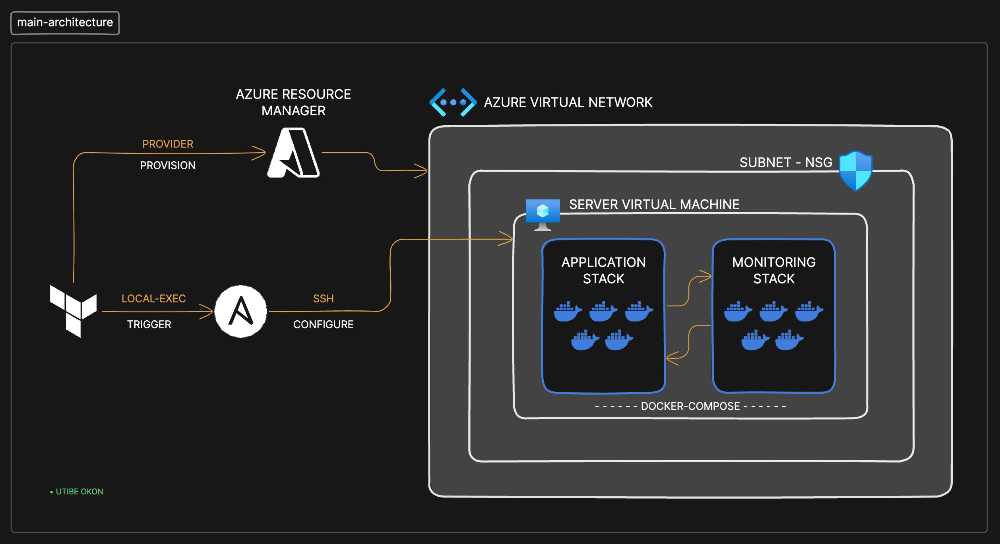

# Automating Full-Stack App Deployments: Terraform and Ansible Integration

## Overview
This project automates the deployment of a full-stack application on Azure by combining Terraform for infrastructure provisioning and Ansible for configuration management. It streamlines the process of creating a robust environment and deploying Docker-based applications.

__Workflow:__
- Provisioning: Terraform creates Azure resources such as virtual networks, NSGs, and virtual machines.
- Configuration: Ansible configures the VMs, installs Docker, and deploys the application stack.
- Deployment: The application and monitoring stack are deployed using Docker Compose.

## Architecture


__Project Structure__
```
project-folder/
│
├── terraform/                # terraform configurations for Azure resources
│   ├── modules/              # terraform modules - includes network and vm modules
│   ├── main.tf
│   ├── variables.tf
│   └── outputs.tf
│
├── ansible/                  # ansible playbooks and roles
│   ├── playbook.yml
│   └── roles/
│       ├── server-setup/     # installs Docker on vms
│       ├── copy-files/       # copies application files and configurations
│       └── deploy-app/       # runs Docker Compose to deploy the stack
│
├── monitoring/               # monitoring stack configuration
│   ├── docker-compose.yml    # full-stack application          
└── README.md                 # readme file
└── docker-compose.yml        # main application stack configurations
└── traefik.yml               # configuration file for traefik
└── .env                      # environmental variable file for app stack
```

## Prerequisites
- Terraform: Install Terraform
- Azure CLI: Installed and configured for authentication
- Ansible: Install Ansible
- Domain Name: Optional, but recommended for production-grade deployments.

## Setting Up
__1. Clone the Repository:__

```bash
Copy code
git clone https://github.com/yutee/devops-tf-ansible.git
cd project-folder
```
__2. Terraform Configuration:__

- Initialize Terraform:
```bash
cd terraform
terraform init
```

- Review and apply the infrastructure plan:
```bash
terraform plan
terraform apply
```

__3. Ansible:__
Terraform will:
- Terraform updates the inventory file with the IP addresses of the provisioned VMs.
- Run the Ansible playbook:

Output:
```bash
vm_public_ip: <ip-address>
```
Copy the IP address to your DNS server and set up dns mapping.

__4. Application Deployment:__
- Verify the application is running by accessing the configured IP or domain after mapping has been configured.

## Best Practices
- State Management: Use a remote backend (e.g., Azure Storage) for Terraform state files to ensure consistency in collaborative environments.
- Modular Design: Structure Terraform and Ansible into reusable modules and roles for maintainability.
- Security:
- - Secure credentials and sensitive data using tools like Azure Key Vault and Ansible Vault.
- - Limit NSG rules to least privilege.
- Testing: Validate configurations with terraform validate and test Ansible playbooks with Molecule.
- Monitoring: Use a monitoring stack to observe application health and performance.